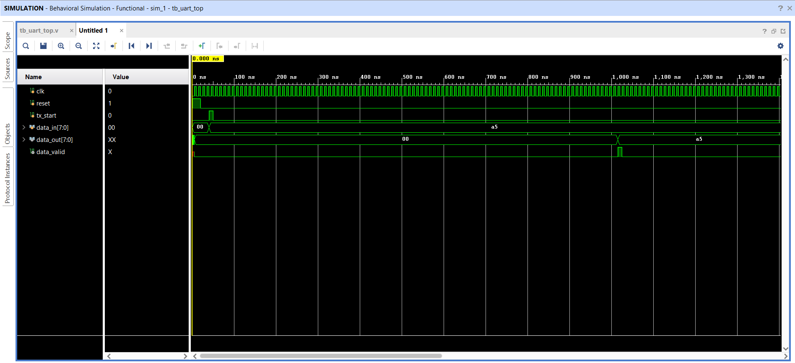

# UART RTL Design (Verilog)

## Overview
This project implements a UART (Universal Asynchronous Receiver Transmitter) in Verilog HDL.

## Features
- UART Transmitter
- UART Receiver
- Baud Rate Generator
- Testbenches for verification
- Simulation waveform

## Folder Structure

rtl/
- uart_tx.v
- uart_rx.v
- baud_gen.v
- uart_top.v

tb/
- tb_uart_tx.v
- tb_uart_rx.v
- tb_baud_gen.v
- tb_uart_top.v

waveform/
- uart_waveform.png

## Simulation Waveform
Below is the verified functional simulation waveform showing the successful transmission and loopback reception of the data:

## Tools Used
- Verilog HDL
- Xilinx Vivado
- Git
- GitHub

## Author
Harshit Singh Chauhan
